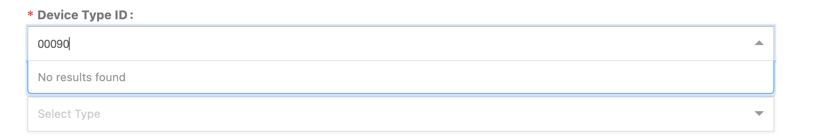
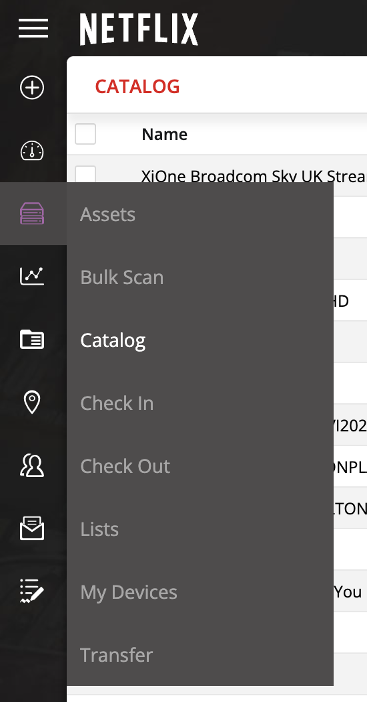
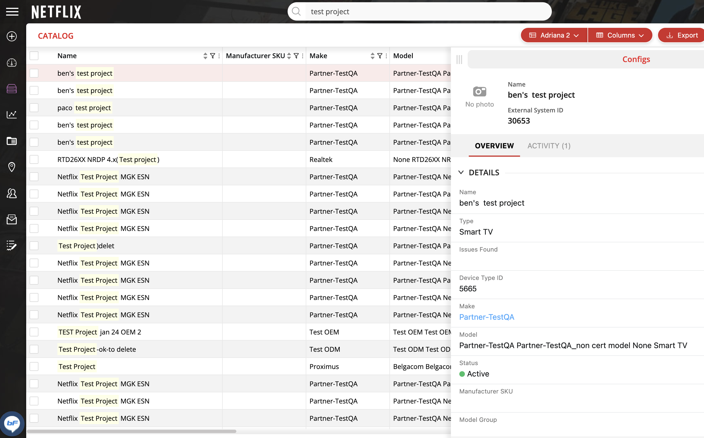
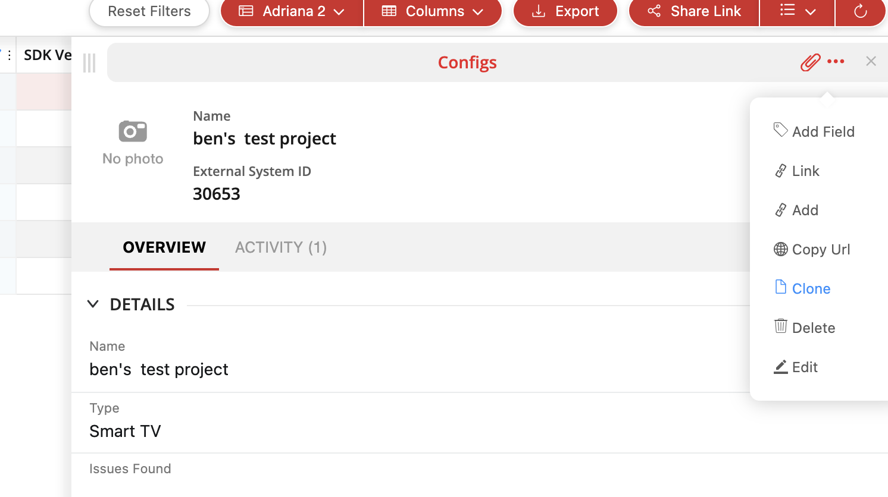
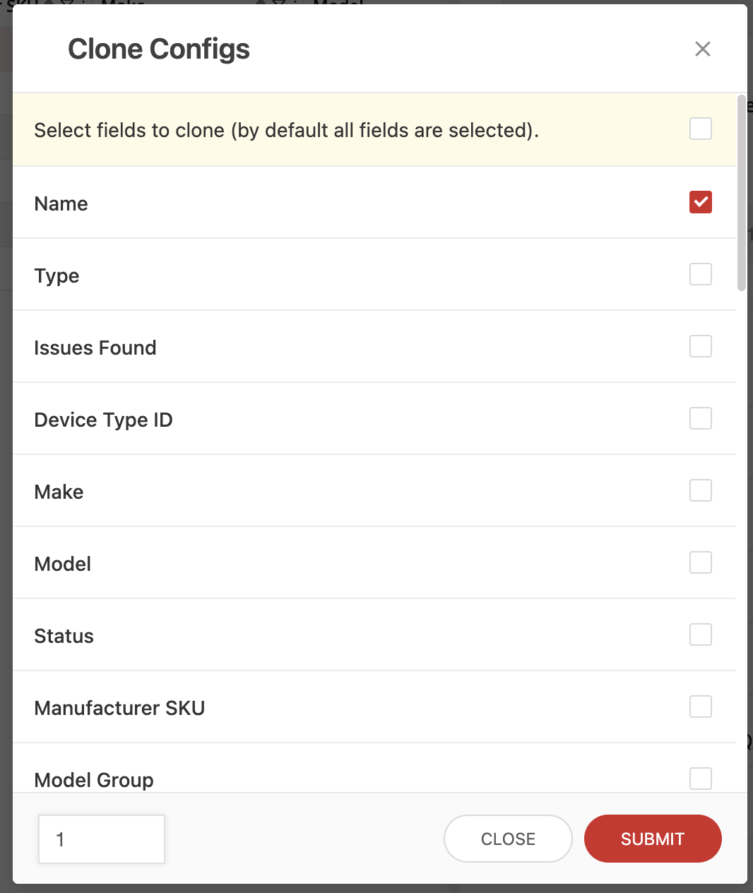
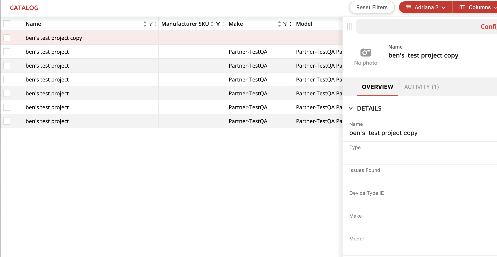
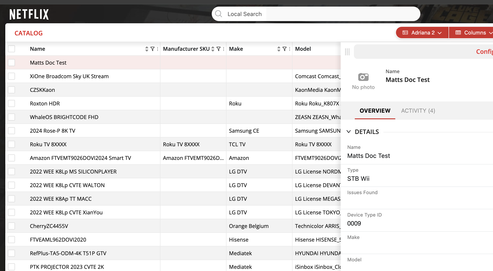

# BitFit: Creating a New Device Type ID 

---

**Status:** In-Progress  
**Author:** Matthew Reddy  
**Audience:**   
**Last Updated:** Mar 20, 2024

**Summary:** This doc is to help you create a new Device Type ID on Bitfit when there isn't an ID to create a new device under.
 
**Pre-Req:** Make sure you are double checking that you have the correct Device Type ID for the device from the Partner Engineer. You shouldn’t have any results populate when you try to create the asset. Refer to below for reference.

### 1. Go to the Catalog section on go/bitfit

   

### 2. On the search bar look up “test project” and utilize the first column that pops up. This is to avoid using any active Device type ID.
   

### 3. Once you click on the row and the pop out comes up go to the top right to where the 3 dots are located for "more actions" and select Clone.
   

### 4. A popup will come up that will prompt you for which fields you would like to copy over to the cloned entry. You only need to select the "Name" option then click submit to finish. 

   

### 5. Refresh the page and you should see the cloned entry at the top of the Catalog page.
   

### 6. You can then click on the entry and enter all the fields accurately from utilizing the info from     go/PDM. Please double check and confirm all the info is accurate. 
   
